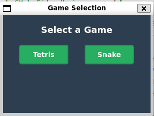
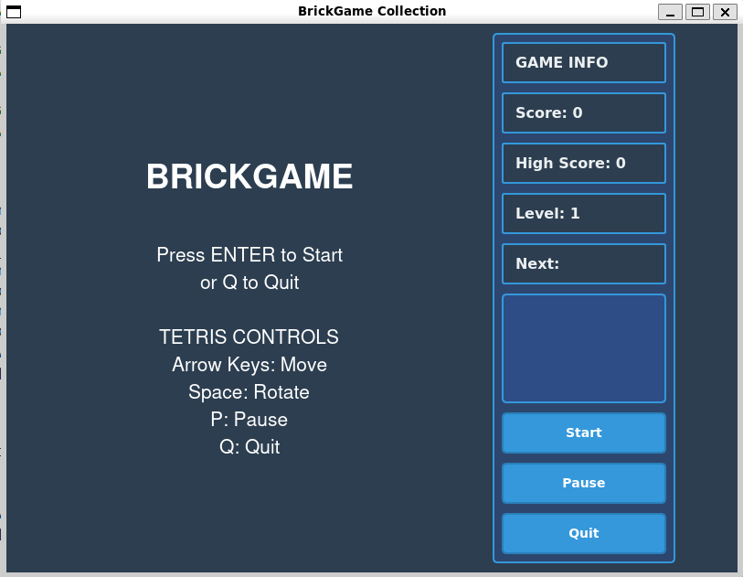
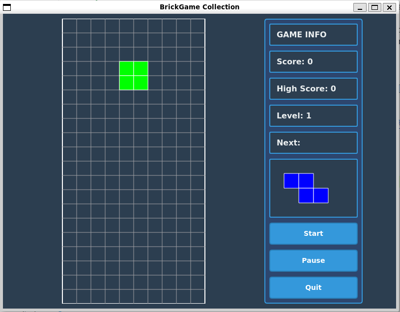
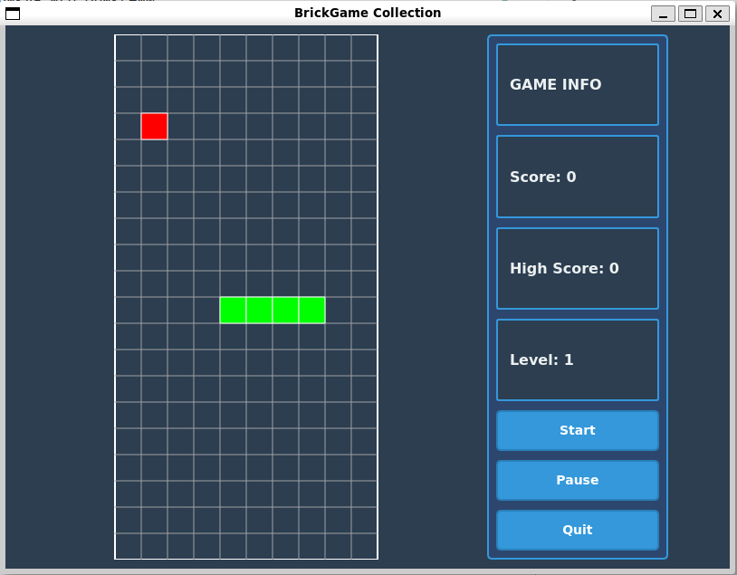
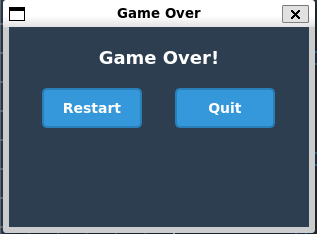
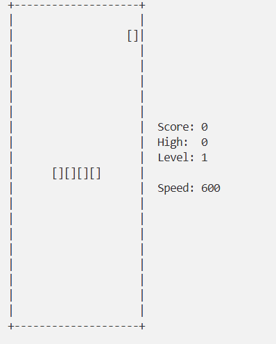

# Snake_game

Данный проект является продолжением цикла игр брикгейм
На данный момент в проекте присутсвуют игры тетрис(С) и змейка(С++)
В данном проекте была реализована игра "Змейка" на С++, реализована графическая версия игры с использование библиотеки qt
Так же в проекте была попытка использования MVC паттерна, сама библиотека змейка использует fsm для переходов состояний игры
Некоторые функции и структуры были четко прописаны в тз без возможности именений
Так же в игре все еще присутвует консольная версия в которую тоже была введена Змейка

### Используемый стек:
* [Qt](https://www.qt.io/)
* [MVC](https://m.wikipedia.org/wiki/Model–view–controller), [Singleton](https://m.wikipedia.org/wiki/Singleton_pattern)
* [FSM](https://ru.wikipedia.org/wiki/%D0%9A%D0%BE%D0%BD%D0%B5%D1%87%D0%BD%D1%8B%D0%B9_%D0%B0%D0%B2%D1%82%D0%BE%D0%BC%D0%B0%D1%82)

### Как запустить проект:

При условии становленного QT

```sh
make
```
Open the application:
```sh
make open_cli

make open_desktop
```

### Визуализация:















